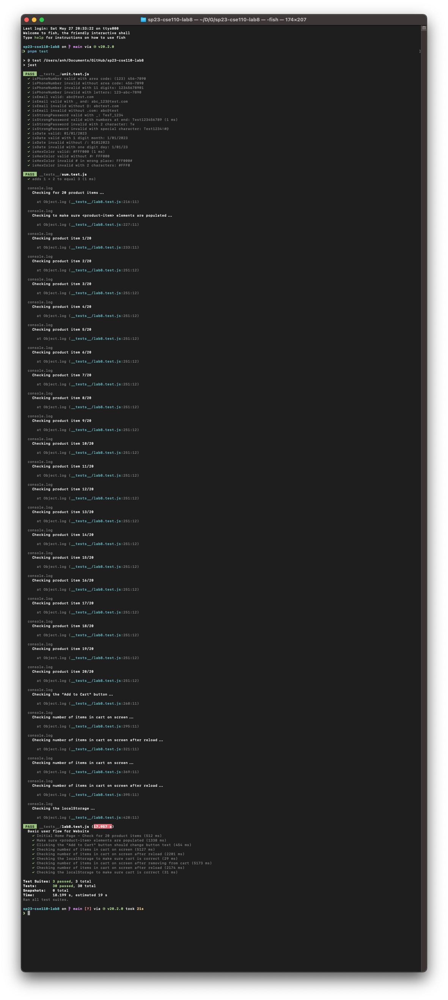

# Lab 8 - Starter

# Author
- Name: Anh Pham

## Description
In this lab, I learned how to use Jest and Puppeteer to test the front-end of my web applications. Jest is a JavaScript testing framework that allows me to write unit tests and end-to-end tests. 😬

# What I Learned
Puppeteer is a library that provides a high-level API to control Chrome or Chromium over the DevTools Protocol. Puppeteer can be used to automate browser actions, such as clicking, typing, and navigating.

# Check Your Understanding Questions
1. Where would you fit your automated tests in your Recipe project development pipeline? Select one of the following and explain why.
    - I would choose both 1. and 2. as possible ways to fit my automated tests in my Recipe project development pipeline. However, if I have to choose only one option, I would say the first one Because:

    - `1. Within a Github action that runs whenever code is pushed`: I choose this one because it allows me to automate my testing process and ensure that my code meets the quality standards before it is merged or deployed. It also helps me catch issues fast and prevent bugs from reaching production environments. I can use tools like Jest and Puppeteer to run different types of tests in my Github action workflow. This way, I will know whenever I have any problems when my code changes, before it comes to production.

    - `2. Manually run them locally before pushing code`: This option is also viable because it allows me to test my code on my own machine and make sure it works as expected. It also helps me avoid pushing broken code on the repo that could cause errors or failures in the pipeline. However, this option has some cons. For example, being time-consuming and dependent on the local environment.

    - `3. Run them all after all development is completed`: This option is not advisable because it delays the testing process and increases the risk of introducing bugs or quality issues into the final product.

2. Would you use an end to end test to check if a function is returning the correct output? (yes/no)
    - No, I would not use an end to end test to check if a function is returning the correct output. Since the end-to-end tests are used to test the entire system or application from start to finish, not individual functions. It is too expensive and time-consuming to use end-to-end tests to test individual functions. Instead, using unit tests to test individual functions would be more appropriate for checking the output of just a function.

3. Would you use a unit test to test the “message” feature of a messaging application? Why or why not? For this question, assume the “message” feature allows a user to write and send a message to another user.
    - I would say it depend. Yes if the "message" feature can be broken down into smaller units of code that can be tested independently, such as the function that creates a message object, the function that validates the message content and length, the function that sends the message to another user, and the function that receives and displays the message2. No if the "message" feature is a complex feature that cannot be broken down into smaller units of code that can be tested independently. Or another "No" if the "message" feature is a feature that requires a user to interact with the application, such as clicking, typing, and navigating.

4. Would you use a unit test to test the "max message length" feature of a messaging application? Why or why not? For this question, assume the "max message length" feature prevents the user from typing more than 80 characters.
   - As I said in the answer 3, it depends. Yes if the "max message length" feature can be broken down into smaller units of code that can be tested independently, such as the function that checks the length of the message, the function that truncates the message if it exceeds the limit, and the function that displays an error message if the user tries to type more than 80 characters. No if the "max message length" feature is a feature that requires a user to interact with the application, such as typing (yes typing typing) and seeing the feedback on the screen.

# Screenshots
